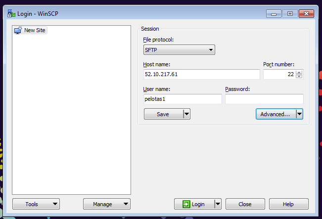
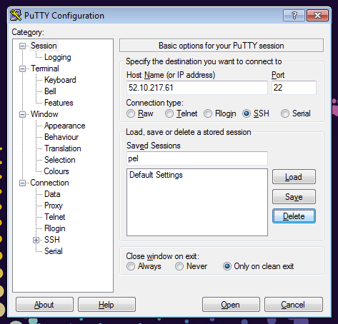

Linux in an hour
================

*Gibran Hemani*

*MRC Integrative Epidemiology Unit, University of Bristol, UK*

* * *

## Objectives

- Learn how to connect to a remote linux computer
- Get familiar with working in linux
- Get a taste of how linux commands can be used for data manipulation
- Introduction to scripting

## Glossary

Term | Explanation
---- | -----------
[Unix](http://en.wikipedia.org/wiki/Unix) | An operating system like Windows but better
[Linux](http://www.ubuntu.com/) | An operating system based on Unix
[Command line](http://en.wikipedia.org/wiki/Command-line_interface) | The means of interacting with a computer program where the user issues commands to the program in the form of successive lines of text
[Local computer](http://en.wikipedia.org/wiki/Remote_computer) | The computer that you are using directly
[Remote computer](http://en.wikipedia.org/wiki/Remote_computer) | The computer you are interfacing with through a network connection. Also known as "Remote Server" or the "Host"
[SSH](http://en.wikipedia.org/wiki/Secure_Shell) | Secure shell - an encrypted method of connecting to a remote computer
[Putty](http://www.putty.org/) | A programme that is used to connect from a local Windows computer to a remote Unix computer
SFTP client | A programme that is used for transferring files to and from a local Windows computer and a remote computer
[WinSCP](http://winscp.net/) | An example of an SFTP client
[Public / private key pair](http://security.stackexchange.com/questions/25741/how-can-i-explain-the-concept-of-public-and-private-keys-without-technical-jargo) | A pair of files that are used to authenticate a user and can be used to connect to a server instead of having to type in a password
[Script](http://linuxcommand.org/lc3_writing_shell_scripts.php) | A list of commands that can be executed without user interaction
[Variable](http://en.wikipedia.org/wiki/Variable_%28computer_science%29) | A symbolic name for some specified value that can be used to substitute the value into commands throughout the script
[File path](http://en.wikipedia.org/wiki/Path_%28computing%29) | The location of a file in the computer's directory structure

## Further reading

- This is a great introductory tutorial: [linuxcommand.org](http://linuxcommand.org/)
- Great forum for questions and answers: [stackoverflow.com](http://www.stackoverflow.com)
- Just google what you need to know, vast amounts of information on all things to do with linux and scripting on the internet

## Getting connected

A lot of servers use Linux and we need to use a server to run a few specific programmes so let's get familiar with Linux.

First of all, to connect to the server we will use a SSH connection. The idea is that we log in to the *remote* server from our *local* computer, so when we are running anything on the server we are using its hardware and infrastructure and our local computer is being used to simply view what is happening remotely and to input commands. 

Here is a diagram:

The objective of this tutorial is to give you a fast introduction to connecting to a remote Linux computer, finding your way around using the command line interface, manipulating files and writing scripts.

We will use a programme called [Putty](http://www.putty.org/) to allow us to interact with the remote server, and a programme called [WinSCP](http://winscp.net/) to transfer files between our local computer and the remote server.

### Transferring files

We can transfer files between the local and remote computers by using an "SFTP client" (e.g. [WinSCP](http://winscp.net/)). Open up WinSCP and then type in the IP address and username:

Next click on "Advanced" then the "Authentication" tab on the left hand side of the new window:

Click the "..." button to load a private key. Your private key is called `pelotas.ppk` and you should be able to find it on your USB stick.

Success! You should see a new screen open up that looks like this:

The left hand side is where you can view the files on the local computer, the right hand side is the remote computer. You can copy files to and from local and remote by clicking and dragging.

Notice that the directory structure on the remote Linux computer can be navigated in exactly the same way as one would do on a Windows computer - i.e. it is an heirarchical file structure.

### Logging into the server 

We will use "Putty" to open up a command line interface to the remote server so that we can issue commands and interact etc. To connect we need to tell "Putty" the remote server's address and our security credentials. Open up "Putty" and type in the IP address:

Next click on "SSH" on the left panel and then "Auth":

Click "Browse" and find the `pelotas.ppk` private key on the USB stick again.

If you now click on "Session" again you can enter a name in the "Saved sessions" box and click "Save". This will make Putty remember your settings for next time. Now click "Open" and a black screen will appear. Type in your username when it prompts you and we should be granted access. You now have a command line interface into the remote server. Whatever you type in this window will be executed on the remote server. 

## Directory structure and navigation

The files and folders on Linux are organised in the same way as they are in Windows - in a heirarchical structure. At the very top of the structure is the **root** directory which is denoted by a single slash `/`. Everything else is a sub-directory (or sub-sub-directory or sub-sub-sub-directory etc) of the root directory. Unlike DOS or Windows filesystems that have multiple “roots”, one for each disk drive, the Linux filesystem mounts all disks somewhere underneath the `/` filesystem.

As a user you have a home directory, *e.g.* the directory for user **pelotas1** is located at `/home/pelotas1`. Now that you have logged in you can see the "path" to your home directory:

  pwd

This command tells you your present working directory, or where you are in the file system heirarchy at this moment. By default when you log into the remote computer you are taken to your home directory.

We can see what files are in this directory using the `ls` command:

	ls

If we want to see details about the files we can pass a "flag" to the `ls` command:

	ls -l

This shows you the file permissions, the file owner, the user group, the file size in bytes, when it was last modified, and finally, the file name itself.

To navigate to a different directory we use the `cd` command. Let's navigate into the `pelotas_2015` directory and see what files are there:

	cd pelotas_2015
	ls -l

A shortcut for specifying the home directory is to use the `~` sign. This means that for example if user **pelotas1** wants to go to their home directory they could type either the full path:

	cd /home/pelotas1

or use the shortcut:

	cd ~

Let's look at another directory, this is where the data will be for some of the tutorials:

	cd /pelotas_data
	ls -l

In order to navigate back to the directory that we were last in we can use another shortcut:

	cd -

And if we want to travel to the directory one level up in the heirarchy we can use this shortcut:

	cd ../

## Viewing, editing, copying, renaming, moving and making files

There are a few ways to view a file, for example let's look at the source code that was used to make this README file:

	cd ~/pelotas_2015/unix_tutorial
	less README.md

The `less` programme is simply used for viewing files, it cannot be used for editing. An example of opening a file in `less` is that even if it is a huge file it won't take a long time to load up, it just loads a small section at a time. Once you are in the `less` programme you can scroll through the file by using the up and down arrows, and you can page down and page up using the `f` and `b` keys. To exit the `less` programme and return to the command line simply press `q`.

We can create a new file using the `touch` command. Make a new file called "hello" like this:

	touch hello
	ls -l

We can see this created a new file called `hello` which is 0 bytes. There are many text editors that are commonly used in Linux. A simple one is `nano`. To edit `hello` the following command will open the file in a text editor:

	nano hello

We can use the arrow keys to move around and we can type here as normal. Type in some text and then save and exit. To do this press `ctrl` + `x` and then type `y` to save the changes. We can see the new changes in the file by viewing it again:

	less hello

And we can also see that it is no longer 0 bytes in size:

	ls -l

We can make a copy of the file using the `cp` command. This takes two or more arguments, the first is (are) the name(s) of the file(s) that you want to copy, the last is the location that you want to copy it (them) to. For example to copy `hello` to a new file called `hello_copy` we run:

	cp hello hello_copy

It's also possible to copy multiple files to a new directory, for example to copy `hello` and `hello_copy` to the `data/` directory we would write:

	cp hello hello_copy data/
	ls -l data/

An alternative way to specify multiple files is to use the wildcard character `*`:

	cp hello* data/

This will copy all files that start with "hello" to the `data/` directory, i.e. this includes `hello` and `hello_copy`.

**Note:** It's really easy to overwrite a file in Linux! This is an irreversible action so be careful when you are executing commands.

It's possible to move a file rather than copy it using the `mv` command. For example to rename a file we could use the `mv` command:

	mv `hello` `hello_renamed`
	ls -l

The `hello` file is gone and it has been replaced by the `hello_renamed` file. Or we could simply move the file to a new location, e.g.

	mv hello_renamed data/
	ls -l
	ls -l data/

The `hello_renamed` file has now been moved to the `data/` directory. Finally, we can delete files using the `rm` command. 

**Task:** Using the wildcard delete all the files that begin with `hello` in the `~/pelotas_2015/unix_tutorial/` and the `~/pelotas_2015/unix_tutorial/data/` directories. This is easily done with two commands, can you do it in a single command?

## Data manipulation and using pipes

The Unix command line has a lot of built in utilities that make it very convenient and fast to manipulate data. For example, the `cut`, `grep`, `sed`, `awk`, `paste`, `cat`, `head`, `tail`, `sort`, `uniq` (and many more) commands can all be used to perform specific actions to manipulate data. To see the instruction manual on a particular command you can use the `man` command, for example, find out what the `head` command does and what its options are:

	man head

You will notice it opens up a text file in the `less` programme, you can exit by pressing `q`.

Let's manipulate some data. Navigate to the `~/pelotas_2015/unix_tutorial/data/` directory and you will find a file called `snpdata.txt`

	cd ~/pelotas_2015/unix_tutorial/data/
	ls -l

Let's see what it looks like:

	less snpdata.txt

This file contains information about some (fictitious) SNPs. The first column is the chromosome, the second column is the SNP name, the third column is the SNP's position on the chromosome. We can find out how many rows there are in the file using the `wc` command. Exit `less` (`q`) and run:

	wc snpdata.txt

This prints out 3 numbers, the first is the number of lines in the file, the second is the total number of words and the third is the total number of characters. So this file has 500 rows and 3 columns.

Try the `head` command on the file:

	head snpdata.txt

It printed justs the first 10 lines to the screen. We can pass a flag to `head` to make it print however many lines we want, e.g. to print the first 20 lines:

	head -n 20 snpdata.txt

Try using the `tail` command instead of the `head` command - what is it doing differently?

One way to extract a particular column from a file is to use `cut`. For example, to extract only the SNP names from the file we can tell `cut` to only print the second column:

	cut -d " " -f 2 snpdata.txt

The way the `cut` syntax works is that the `-d` flag specifies the "delimeter" or character that separates columns (in this case a single space, `" "`), and the `-f` flag specifies which column or columns to print. `-f 2` means print column 2. `-f 1-3` would mean print columns 1 to 3. As you can see this printed out 500 lines each with a single SNP name per row. An alternative to printing everything to the screen is to **redirect** the output to the `less` programme. To do this we will use the "pipe" operator `|`:

	cut -d " " -f 2 snpdata.txt | less

This time it outputted the results from the `cut` command were piped into the `less` programme where you can view them by scrolling up and down as mentioned above. To exit `less` press `q`. Instead of redirecting to `less` we can actually redirect the output from `cut` to be saved into a new file using the `>` operator. For example, to save all the SNP names in a new file called `snpnames.txt` we would do:

	cut -d " " -f 2 snpdata.txt > snpnames.txt
	ls -l

As you can see this has created a new file called `snpnames.txt`, and if you use `less` to view the new file it is as we expect the list of SNP names generated by the `cut` command.

If you want to find lines that have a particular pattern in a file you can use the `grep` command. For example, suppose we want to know details about the "rs2159313" SNP, we could do:

	grep "rs2159313" snpdata.txt

It has extracted the row that contains the string "rs2159313", and we can see that it is on chromosome 17 at position 2335972. What if we want to see all the SNPs on chromosome 17? We can tell `grep` to only extract rows with "17" but unfortunately this also picks up some rows that have the "17" string either in the SNP name or the position:

	grep "17" snpdata.txt

Instead we can specify to only extract rows if the string "17" is at the beginning of the line using the `^` character:

	grep "^17 " snpdata.txt

One of the powerful things about Linux is that you can manipulate data quite effectively by chaining together many commands using as many pipes as you like. For example if we wanted to **save only the first 5 SNP names from chromosome 17 into a new file called "extract17.txt"**. We could first `grep` the rows beginning with "17", then use `head` to take only the first 5 rows from the output from `grep`, then use `cut` to only select the second column from the output from `head`. 

	grep "^17 " snpdata.txt | head -n 5 | cut -d " " -f 2 > extract17.txt

Notice that there is a new file called "extract17.txt". Take a look!

## Scripts

An important aspect of handling data is making sure that what you do is **reproducible**. This means that you can re-perform the same actions months later if necessary, or that somebody else can re-run them and understand what is going on. 

Writing scripts can be a really good way to enable this. A script is a collection of commands that are saved in a file which can all be executed in sequence. Scripts can also contain annotations (or "comments") that won't be executed by the computer when the script is run, but are there for humans to read to help understand what is going on in the script.

Scripts can be written in the Linux **bash** language, or any number of other languages such as Stata, R, Python etc etc etc. Let's look at some **bash** scripts.

For example, if we use the output from our command to extract the 5 SNPs from chromosome 17 in subsequent work, it might be useful to record how we got hold of those 5 SNPs in the first place. Such a script has been made and is sitting in the `~/pelotas_2015/unix_tutorial/scripts/` folder. Let's navigate to there

	cd ~/pelotas_2015/unix_tutorial/scripts/
	ls -l

Take a look at the `extract17.sh` script:

	less extract17.sh

If we run the scrip the following lines will be executed by the terminal:

	#!/bin/bash
	cd ~/pelotas_2015/unix_tutorial/data/
	grep "^17 " snpdata.txt | head -n 5 | cut -d " " -f 2 > extract17_from_script.txt

The first line tells the terminal that it will be using the `bash` language. The second line tells the terminal to navigate to the directory we want. The third line is the command to extract the SNP names. The only difference between this third line and the example above is that we will be saving the output to the file "extract17\_from\_script.txt".

In addition to those commands the script has a number of lines that begin with the `#`. These are "comments" that you can use to annotate the script. They will be ignored when the script is run by the computer.

To run the script the first thing we need to do is to make sure that it is executable, which involves changing its permissions. Do this by running the command

	chmod 755 extract17.sh

Now we can execute the script as follows:

	./extract17.sh

If we take a look in the data directory we will see that the new output has been generated:

	ls -l ../data/
	less ../data/extract17_from_script.txt

### Variables

Sometimes it's useful to store values in variables. Variables are essentially a way to substitute in a particular value into multiple locations in a script. This can be useful for lots of reasons, for example it means if that value changes at some point then all you need to do is change the variable delcaration once and the new substituted value will be used throughout the script.

For example take a look at the `extract17_variables.sh` script:

	less extract17_variables.sh

It has the following commands:

	chromosome="17"
	number_of_rows="5"
	grep "^${chromosome} " snpdata.txt | head -n ${number_of_rows} | cut -d " " -f 2 > extract${chromosome}_from_script_variable.txt

The first line declares a new variable, storing the value "17" to the variable "chromosome". The second line assigns the value "5" to the variable "number\_of\_rows". The third command shows how the variables that we have just declared are used to substitute in the values that we want into the script.

So to recap. To declare a variable:

	variablename="value"

To call the variable:

	${variablename}

Make the `extract17_variables.sh` script executable and run:

	chmod 755 extract17_variables.sh
	./extract17_variables.sh

And find the new file in `../data/` - check that it is the same as the others.

Variables that have been declared in one script can be imported into other scripts, which means that if lots of scripts require the same variable then you can declare them in one place and have all the scripts just call the one file with your variables. You may have noticed a file in the `~/pelotas_2015/` directory called `config`. It has the following lines:

	workdir="${HOME}/pelotas_2015"
	datadir="/pelotas_data"

Here we are declaring a variable for the location of the working directory and a variable for the location of the data directory. Notice that the working directory variable includes a variable called `${HOME}` - this is a variable that is defined in the Linux environment by default and its value is the full path to the users home directory, i.e. it is the same as the `~` shortcut, but declared as a variable. You can see that it has the path to the home directory by running

	echo ${HOME}

in the command line which should print out the home directory path.

The `extract17_source.sh` script is another extension of the original `extract17.sh` file which shows how to call the `config` file. The relevant lines are:

	source ../../config
	echo ${workdir}
	cd ${workdir}/unix_tutorial/data/

The `source` function tells the script to run `../../config`. This should cause the `${workdir}` variable to be made available to the script, which is tested by using the `echo` command to print to screen. Finally, the `${workdir}` variable is used in the `cd` command to navigate to the data folder.

Run the script and check that it is making the same output as the other versions of the script.

### Interrupting a running command or script

Sometimes you might run a command or a script and you would like to be able to stop it and regain control of the command line. The way to do this is to press `ctrl` + `c`. For example, if you run the following command:

	sleep 20

It will cause a programme to run that does nothing for 20 seconds. Try running it and exiting out of the `sleep` programme by pressing `ctrl` + `c`.

Alternatively you may wish to simply pause or suspend the programme for running temporarily. While a script is running this can be done using the `ctrl` + `z` commands. The script can then be resumed by using either the

	fg

command which will make the command resume running as it was previously, or the 

	bg

command which will resume the programme but this time it will complete in the background allowing you to regain control of the command line while it is still running. To make a command run in the background when you execute it simple add an `&` at the end, e.g.

	sleep 20 &

## Running R scripts in a bash script

You will learn all about R programming tomorrow, but for now just a very quick point that you can run R scripts within bash scripts or from the command line in Linux directly. For example, in the scripts folder there is a file called `fake_data.R` which was used to generate the `snpdata.txt` file. It is possible to execute this script from the command line with:

	R --no-save < fake_data.R

Similarly, this can be included within your bash scripts which means you can combine R functionality and bash functionality together.

## And finally...

So that is the end of the introduction to linux. This is just a taste of what can be done with linux and it covers the main processes that have been implemented in the "GWAS" and "whole genome" practicals. 

By no means do you need to memorise all of this, all the scripts for the practicals have been written already and the hope is that this practical will at the very least help you understand what the scripts are doing.

Moving forwards, there are vast amounts of resources online that can be helpful to learn more about using Linux and good practices for scripting etc.

Good luck!

