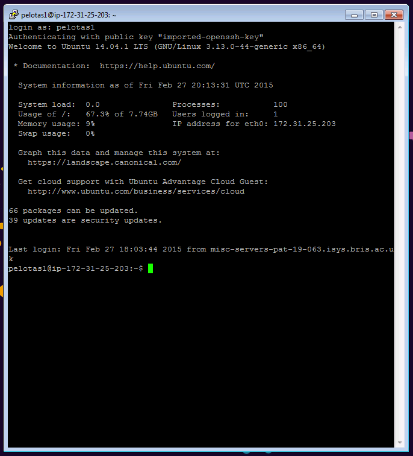

Linux in an hour
================

*Gibran Hemani and Matthew Suderman*   
*MRC Integrative Epidemiology Unit, University of Bristol, UK*

* * *

## Objectives

- Learn how to connect to a remote linux computer
- Get familiar with working in linux
- Get a taste of how linux commands can be used for data manipulation
- Introduction to scripting

## Glossary

Term | Explanation
---- | -----------
[Unix](http://en.wikipedia.org/wiki/Unix) | An operating system like Windows but better.
[Linux](http://www.ubuntu.com/) | An operating system based on Unix.
[Command line](http://en.wikipedia.org/wiki/Command-line_interface) | The means of interacting with a computer program where the user issues commands to the program in the form of successive lines of text.
[Local computer](http://en.wikipedia.org/wiki/Remote_computer) | The computer that you are using directly.
[Remote computer](http://en.wikipedia.org/wiki/Remote_computer) | The computer you are interfacing with through a network connection. Also known as "Remote Server" or the "Host".
[SSH](http://en.wikipedia.org/wiki/Secure_Shell) | Secure shell - a program for connecting to a remote computer that enrypts everything sent between computers.
[Putty](http://www.putty.org/) | A program that is used to connect from a local Windows computer to a remote Unix computer.
SFTP client | A program that is used for transferring files to and from a local Windows computer and a remote computer.
[WinSCP](http://winscp.net/) | An example of an SFTP client.
[Public / private key pair](http://security.stackexchange.com/questions/25741/how-can-i-explain-the-concept-of-public-and-private-keys-without-technical-jargo) | A pair of files that are used to authenticate a user and can be used to connect to a server instead of having to type in a password.  One file is made public and is used to encrypt a message.  Once enrypted, a message cannot be read without the private key file to decrypt the message.
[Script](http://linuxcommand.org/lc3_writing_shell_scripts.php) | A list of commands in a file that can be executed without user interaction.
[Variable](http://en.wikipedia.org/wiki/Variable_%28computer_science%29) | A name and a memory location in the computer storing a value such as a number or sequence of characters. When a script with a variable is executed, the variable name is replaced with the value stored at the memory location. It is called a 'variable' because it is possible to make the script change the stored value as the script is executed. For example, a script that reads a file line by line could have a variable that stores the current line number being read.
[File path](http://en.wikipedia.org/wiki/Path_%28computing%29) | The location of a file on a computer. Files on computer are organized in a hierarchical or tree-like structure.  Files are like leaves on the tree, and directories are like branches. Directories may contain a list of files and other directories. The 'file path' provides the path consisting of the list of directories from the root of the tree to the directory containing the file.

## Further reading

- This is a great introductory tutorial: [linuxcommand.org](http://linuxcommand.org/)
- Very active forum for questions and answers: [stackoverflow.com](http://www.stackoverflow.com)
- Just google what you need to know, vast amounts of information on all things to do with linux and scripting on the internet

## Getting connected

A lot of servers use Linux because it is fast and stable, and we need to use a server to run a few specific programs so let's get familiar with Linux.

First of all, to connect to the server we will use a *secure shell (SSH)* connection. The idea is that we connect to the *remote* server from our *local* computer and execute commands on the remote server and see the results on our local computer.

Here is a diagram:

The objective of this tutorial is to give you a quick introduction to connecting to a remote Linux server, finding your way around using the command line interface, manipulating files on the remote server and writing scripts to be executed on the remote server.

We will use a program called [Putty](http://www.putty.org/) to allow us to connect and interact with the remote server and a program called [WinSCP](http://winscp.net/) to transfer files between our local computer and the remote server.

### Transferring files

We can transfer files between the local and remote computers by using an *SFTP client* (e.g. [WinSCP](http://winscp.net/)). Open up WinSCP and then type in the IP address and username:

Next click on "Advanced" then the "Authentication" tab on the left hand side of the new window:

Click the "..." button to load a private key. Your private key is called `pelotas.ppk` and you should be able to find it on your USB stick.

Success! You should see a new screen open up that looks like this:

The left hand side is where you can view the files on the local computer, the right hand side is the remote computer. You can copy files to and from local and remote by clicking and dragging.

Notice that the directory structure on the remote Linux computer can be navigated in exactly the same way as one would do on a Windows computer. In other words, the files are organized using a tree-like structure.  Consequently, clicking on a directory name displays the list of the files and directories within that directory. This is like moving away from the tree root from a main branch onto a smaller branch. Clicking the directory named ".." takes you back to the previous directory, closer to the root.

### Logging into the server 

We will use "Putty" to open up a command line interface to the remote server so that we can interact with the remote computer by issuing commands and viewing results. To connect we need to tell "Putty" the remote server's address and our security credentials. Open up "Putty" and type in the IP address:

Next click on "SSH" on the left panel and then "Auth":

Click "Browse" and find the `pelotas.ppk` private key on the USB stick again.

If you now click on "Session" again you can enter a name in the "Saved sessions" box and click "Save". This will make Putty remember your settings for next time. Now click "Open" and a black screen will appear. 

Type in your username when it prompts you and we should be granted access. You now have a command line interface into the remote server. 

Whatever you type in this window will be executed on the remote server. 

## Directory structure and navigation

The files and folders on Linux are organised in the same way as they are in Windows - in a heirarchical or tree-like structure. At the very top of the structure is the **root** directory which is denoted by a single slash `/`. Everything else is a sub-directory (or sub-sub-directory or sub-sub-sub-directory etc) of the root directory. Unlike DOS or Windows filesystems that have multiple “roots”, one for each disk drive, the Linux filesystem mounts all disks somewhere underneath the `/` directory.

As a user you have a home directory, *e.g.* the directory for user **pelotas1** is located at `/home/pelotas1`. Now that you have logged in you can see the "path" to your home directory:

  pwd

This command prints the path of the present working directory, your current location in the file system heirarchy. When you log into the remote computer, your initial present working directory is your home directory.

We can see what files are in this directory using the `ls` command:

	ls

If we want to see details about the files we can pass a "flag" to the `ls` command:

	ls -l

This shows the file permissions, the file owner, the user group, the file size in bytes, when the file was last modified, and finally, the name of the file itself.

To navigate to a different directory we use the `cd` command. Let's navigate into the `pelotas_2015` directory and see what files are there:

	cd pelotas_2015
	ls -l

A shortcut for specifying the home directory is to use the `~` sign. This means that for example if user **pelotas1** wants to go to their home directory they could type either the full path:

	cd /home/pelotas1

or use the shortcut:

	cd ~

Let's look at another directory, this is where the data will be for some of the tutorials:

	cd /pelotas_data
	ls -l

And if we want to travel to the directory one level up in the heirarchy we can use this shortcut:

	cd ../

## Viewing, editing, copying, renaming, moving and making files

There are a few ways to view a file, for example let's look at the text version of this README file:

	cd ~/pelotas_2015/unix_tutorial
	less README.md

The `less` program is simply used for viewing files, it cannot be used for editing. An advantage of opening a file in `less` is that even if it is a huge file it won't take a long time to load up, it just loads only as much as can fit on the screen. Once you are in the `less` program we move forward and backward in the file one line at a time using the up and down arrows and one page at a time using the `f` and `b` keys. To exit the `less` programme and return to the command line, we simply press `q`.

We can create a new file using the `touch` command. Make a new file called "hello" like this:

	touch hello
	ls -l

We can see this created a new file called `hello` which is 0 bytes (i.e. it is empty). There are many text editors that are commonly used in Linux. A simple one is `nano`. The following command will open the file for editing:

	nano hello

We can use the arrow keys to move around and we can type here as normal. Type in some text and then press `ctrl` + `x` to close the file and then type `y` when prompted to save the changes. We can see the new changes in the file by viewing it again:

	less hello

And we can also see that it is no longer 0 bytes in size:

	ls -l

We can make a copy of the file using the `cp` command. Typing the following will create a new file `hello_copy` containing exactly the same contents as `hello`.

	cp hello hello_copy

The inputs or arguments to the `cp` command here are `hello` and `hello_copy`. The `cp` command is very flexible. It can also be used to make copies of files in another directory.  For example, to copy `hello` and `hello_copy` to the `data/` directory we would write:

	cp hello hello_copy data/
	ls -l data/

An alternative way to specify multiple files is to use the wildcard character `*`:

	cp hello* data/

This will copy all files that start with "hello" to the `data/` directory, i.e. this includes `hello` and `hello_copy`.

**Note:** If there is already a file named `hello` or `hello_copy` in the `data/` directory, then that file will be deleted and replaced by the files being copied.  We see say that file in `data/` was overwritten. This cannot be reversed so be careful when you are executing commands!

If you do not like the name of a file, it is possible to rename it using the `mv` command, e.g.

	mv `hello` `hello_renamed`
	ls -l

The name `mv` means "move".  As the name suggests, it can also be used to move a file to a different directory, e.g.

	mv hello_renamed data/
	ls -l
	ls -l data/

The `hello_renamed` file has now been moved to the `data/` directory. Finally, we can delete or remove files using the `rm` command.

**Task:** Using the wildcard delete all the files that begin with `hello` in the `~/pelotas_2015/unix_tutorial/` and the `~/pelotas_2015/unix_tutorial/data/` directories. This is easily done with two commands, can you do it in a single command?

## Data manipulation and using pipes

Linux has many commands that make it very convenient and fast to manipulate data. Examples include `cut`, `grep`, `sed`, `awk`, `paste`, `cat`, `head`, `tail`, `sort`, `uniq`. To see the instruction manual for a particular command we use the `man` command, e.g.

	man head

You will notice it opens up a text file in the `less` programme, you can exit by pressing `q`.

Let's manipulate some data. Navigate to the `~/pelotas_2015/unix_tutorial/data/` directory and you will find a file called `snpdata.txt`

	cd ~/pelotas_2015/unix_tutorial/data/
	ls -l

Let's see what it looks like:

	less snpdata.txt

This file contains information about some (fictitious) SNPs. The first column is the chromosome, the second column is the SNP name, the third column is the SNP's position on the chromosome. We can find out how many rows (i.e. SNPs) there are in the file using the `wc` command. Exit `less` (`q`) and run:

	wc snpdata.txt

This prints out 3 numbers, the first is the number of lines in the file, the second is the total number of words and the third is the total number of characters. So this file has 500 rows and 3 columns.

Try the `head` command on the file:

	head snpdata.txt

This prints the first 10 lines of the file. We can pass a flag to `head` to make it print however many lines we want, e.g. to print the first 20 lines:

	head -n 20 snpdata.txt

Try using the `tail` command instead of the `head` command - what is it doing differently?

One way to extract a particular column from a file is to use `cut`. For example, to extract only the SNP names from the file we can tell `cut` to only print the second column:

	cut -d " " -f 2 snpdata.txt

The `-d` flag specifies the "delimeter" or character that separates columns (in this case a single space, `" "`), and the `-f` flag specifies which column or columns to print. `-f 2` means print column 2. `-f 1-3` would mean print columns 1 to 3. As you can see this printed out 500 lines each with a single SNP name. Because file contains many more lines than can been seen on the screen, most of the SNP names scroll by and disappear before we have a chance to look at them. To view the SNP names one page at a time, we **redirect** the output of `cut` to the `less` programme using the "pipe" operator `|`:

	cut -d " " -f 2 snpdata.txt | less

Now the entire list of SNP names can be viewed by scrolling up and down in the `less` program as mentioned above. To exit `less` press `q`. We save the output of `cut` to a new file using the `>` operator, e.g. to put all of the SNP names in a new file called `snpnames.txt`:

	cut -d " " -f 2 snpdata.txt > snpnames.txt
	ls -l

This has created a new file called `snpnames.txt`, and we can use `less` to view the list of SNPs in the file.

If you want to find lines that have a particular pattern in a file you can use the `grep` command. For example, suppose we want to know details about the "rs2159313" SNP, we could do:

	grep "rs2159313" snpdata.txt

It has extracted the row that contains the string "rs2159313", and we can see that it is on chromosome 17 at position 2335972. What if we want to see all the SNPs on chromosome 17? We can tell `grep` to only extract rows with "17" but unfortunately this also picks up some rows that have the "17" string either in the SNP name or the position:

	grep "17" snpdata.txt

Instead we can specify to only extract rows if the string "17" is at the beginning of the line using the `^` character:

	grep "^17 " snpdata.txt

One of the powerful things about Linux is that we can manipulate data quite effectively by chaining together many commands using as many pipes (`|`) as you like. For example, to **save only the first 5 SNP names from chromosome 17 into a new file called "extract17.txt"**, we would first `grep` the rows beginning with "17", then use `head` to take only the first 5 rows from the output from `grep` output, and then use `cut` to only select the second column from the output from `head`. 

	grep "^17 " snpdata.txt | head -n 5 | cut -d " " -f 2 > extract17.txt

Notice that there is a new file called "extract17.txt". Take a look!

## Scripts

An important aspect of handling data is making sure that what you do is **reproducible**. This means that you or someone else can later repeat the same actions and obtain the same outputs. 

Scripts are files that save the sequence of commands used in an analysis.  They can later be re-executed so that each command is executed in sequence.  As long as the files used in the initial analysis have not changed, then the output of the script should be exactly the same. 

Scripts can also contain annotations (or "comments") that won't be executed by the computer when the script is run. Instead, they are there for humans to read in order to understand the purpose of each command.

For example, if we use the output from our command to extract the 5 SNPs from chromosome 17 in subsequent work, it might be useful to record how we got hold of those 5 SNPs in the first place. Such a script has been made and is sitting in the `~/pelotas_2015/unix_tutorial/scripts/` folder. Let's navigate to the directory:

	cd ~/pelotas_2015/unix_tutorial/scripts/
	ls -l

Take a look at the `extract17.sh` script:

	less extract17.sh

If we run the scrip the following lines will be executed by the computer:

	#!/bin/bash
	cd ~/pelotas_2015/unix_tutorial/data/
	grep "^17 " snpdata.txt | head -n 5 | cut -d " " -f 2 > extract17_from_script.txt

The first line tells the computer that it will be using the `bash` language. This is the language that we have been using to run commands in this tutorial.  There are other languages available but we won't discuss them here.

The second line tells the computer to navigate to the directory we want. The third line is the command to extract the SNP names. The only difference between this third line and the example above is that we will be saving the output to the file "extract17\_from\_script.txt".

In addition to those commands the script has a number of lines that begin with the `#`. These are "comments" that you can use to annotate the script. They will be ignored when the script is run by the computer.

To run the script the first thing we need to do is to tell the computer that the file is a script. This involves changing its permissions to make it "executable". We do this using the following command:

	chmod 755 extract17.sh

Now we can execute the script as follows:

	./extract17.sh

If we take a look in the data directory we will see that the new output has been generated:

	ls -l ../data/
	less ../data/extract17_from_script.txt

### Variables

Sometimes it's useful to store values in variables. Variables are essentially a way to substitute in a particular value into multiple locations in a script. This can be useful for lots of reasons, for example it means that if we decide to change the value of the variable, we only need to make one change to the file.  The change will then be propogated automatically when the script is executed at each place that the variable name appears. 

For example take a look at the `extract17_variables.sh` script:

	less extract17_variables.sh

It has the following commands:

	chromosome="17"
	number_of_rows="5"
	grep "^${chromosome} " snpdata.txt | head -n ${number_of_rows} | cut -d " " -f 2 > extract${chromosome}_from_script_variable.txt

The first line declares a new variable, setting the variable "chromosome" to "17". The second line assigns the value "5" to the variable "number\_of\_rows". The third command shows how the variables that we have just declared are used in a command.

So to recap. To declare a variable:

	variablename="value"

To refer to the variable in a command:

	${variablename}

Make the `extract17_variables.sh` script executable and run:

	chmod 755 extract17_variables.sh
	./extract17_variables.sh

Look at the new file in `../data/`, it should be the same as the others.

Variables that have been declared in one script can be imported into other scripts, which means that if lots of scripts require the same variable then we can declare them in one file and have all the scripts use that file to create the same set of variables. You may have noticed a file in the `~/pelotas_2015/` directory called `config`. It has the following lines:

	workdir="${HOME}/pelotas_2015"
	datadir="/pelotas_data"

Here we are declaring a variable for the location of the working directory and a variable for the location of the data directory. Notice that the working directory variable includes a variable called `${HOME}` - this is a variable that is defined in the Linux environment by default and its value is the full path to the users home directory, i.e. it is the same as the `~` shortcut. You can view the value of a variable using the `echo` command, e.g.

	echo ${HOME}

The `extract17_source.sh` script is another extension of the original `extract17.sh` file which shows how to call the `config` file. The relevant lines are:

	source ../../config
	echo ${workdir}
	cd ${workdir}/unix_tutorial/data/

The `source` function tells the script to execute `../../config`. This will cause the `${workdir}` variable to be made available to the script, which is tested by using the `echo` command to print to screen. Finally, the `${workdir}` variable is used in the `cd` command to navigate to the data folder.

Run the script and check that it is making the same output as the other versions of the script.

### Interrupting a running command or script

Sometimes you might run a command or a script and you would like to be able to stop it in order to run a different command. The way to do this is to press `ctrl` + `c`. For example, if you run the following command:

	sleep 20

The `sleep` command simply does nothing for a specified amount of time, here for 20 seconds.  To stop the command, press the `ctrl` and `c` keys at the same time.

Alternatively you may wish to simply pause or suspend the program for running temporarily. While a script is running this can be done using the `ctrl` + `z` commands. The script can then be resumed by using either the

	fg

command which will make the command resume running as it was previously, or the 

	bg

command which will resume the program but this time it will finish running in the background, allowing us to execute other commands instead of having to wait for it to finish. To make a command run in the background when you execute it simple add an `&` at the end, e.g.

	sleep 20 &

## Running R scripts in a bash script

You will learn all about R programming tomorrow, but for now just be aware that you can run R scripts in Linux. For example, in the scripts folder there is a file called `fake_data.R` which was used to generate the `snpdata.txt` file. It is possible to execute this script from the command line with:

	R --no-save < fake_data.R

We could also include this command in a bash script.

## And finally...

So that is the end of the introduction to linux. This is just a taste of what can be done with linux. We chose to introduce only those linux commands that will be used in the "GWAS" and "whole genome" practicals. 

By no means do you need to memorise all of this, all the scripts for the practicals have been written already and the hope is that this practical will at the very least help you understand what the scripts are doing.

Moving forwards, there are vast amounts of resources online that can be helpful to learn more about using Linux and good practices for scripting etc.

Good luck!

